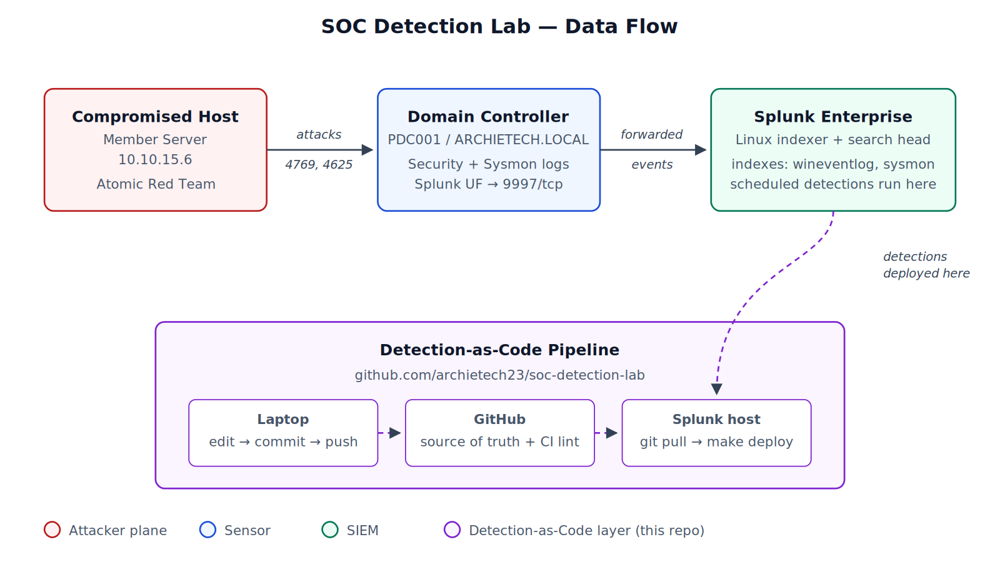
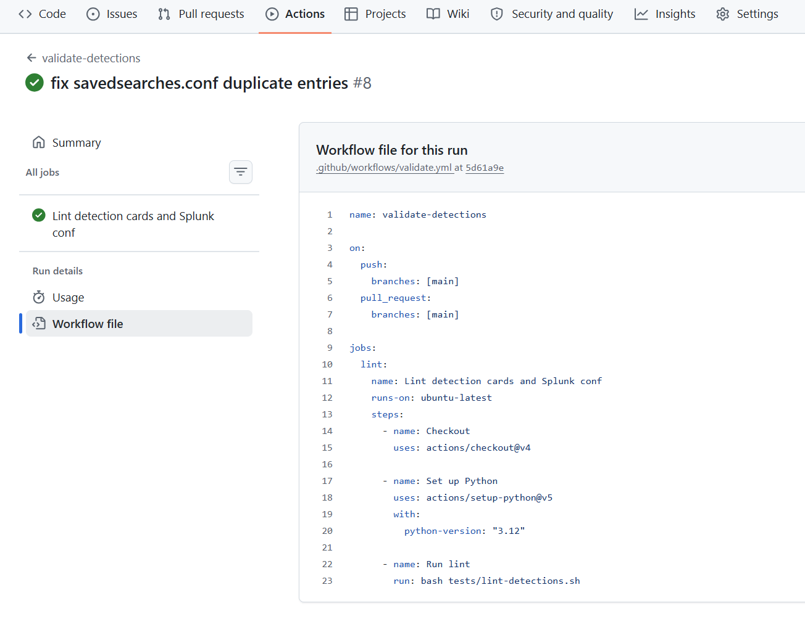

# SOC Detection Lab


A reproducible Splunk-based detection lab for two common Active Directory attacks, built and deployed as code.



## What this is

A small home lab that demonstrates the full detection engineering loop:

1. Stand up a sensor and SIEM (Windows AD + Splunk on Linux).
2. Simulate real attacks against it (Atomic Red Team).
3. Write detections that catch them.
4. Version, lint, and deploy those detections as code.

The detections in this repo are the ones I wrote against the telemetry the attacks produced. They are not copied from a course or a vendor content pack. Every field referenced in the SPL was verified against a captured event.

## Coverage

| Technique | ATT&CK ID | Detection | Log source |
|---|---|---|---|
| Kerberoasting | T1558.003 | [`detections/kerberoasting.md`](detections/kerberoasting.md) | Windows Security 4769 |
| Password Spraying | T1110.003 | [`detections/password-spray.md`](detections/password-spray.md) | Windows Security 4625 |

Both detections return the simulated attack events from live lab telemetry, verified field by field against captured 4769 and 4625 events. See the [incident report](docs/incident-report.md) and the [screenshots](docs/screenshots/).

## Detection-as-Code

The detections live as `.conf` files inside a Splunk app in this repo. Deploying them means cloning the repo on the Splunk host, running `make deploy`, and restarting Splunk. Editing a detection means changing the file, committing, pushing, and pulling on the Splunk host.

```
Laptop:       edit -> git commit -> git push
Splunk host:  git pull -> make deploy
```

The repo also includes:

- A `Makefile` with `validate`, `deploy`, `diff`, and `restart` targets.
- A shell-based lint script (`tests/lint-detections.sh`) that checks every detection card has the required sections and a valid ATT&CK ID, and that the Splunk `.conf` parses.
- A GitHub Actions workflow that runs the lint on every push.

This is what makes the project unusual as a portfolio piece. Most detection labs show a rule. This one shows the pipeline that produces and ships rules.



## Repository layout

```
.
├── README.md                     # this file
├── DEPLOY.md                     # deploy runbook
├── Makefile                      # deploy / validate / diff / restart
├── detections/
│   ├── kerberoasting.md          # detection card: Kerberoasting (T1558.003)
│   └── password-spray.md         # detection card: password spray (T1110.003)
├── docs/
│   ├── architecture.png          # data flow diagram
│   ├── architecture.svg          # diagram source
│   ├── lab-environment.md        # VMs, network, software versions
│   ├── incident-report.md        # investigation write-up of both attacks
│   ├── attack-simulation.md      # how to reproduce the attacks
│   └── screenshots/              # captured 4769 / 4625 / CI evidence
├── splunk-app/
│   └── soc_detection_lab/        # the deployable Splunk app
│       ├── default/app.conf
│       ├── default/savedsearches.conf
│       └── metadata/default.meta
├── tests/
│   └── lint-detections.sh
└── .github/workflows/validate.yml
```

## Quickstart

If you want to reproduce the lab end to end, follow the runbooks in order:

1. [`docs/lab-environment.md`](docs/lab-environment.md) - the VMs, network, and software versions.
2. [`docs/attack-simulation.md`](docs/attack-simulation.md) - reproduce the attacks with Atomic Red Team.
3. [`DEPLOY.md`](DEPLOY.md) - deploy the detections.

If you only want to look at the detections, open the two files under [`detections/`](detections/).

## Scope

**In scope:** detection engineering, log source onboarding, MITRE ATT&CK mapping, versioned and reviewable detection content, a reproducible attack range.

**Not in scope for v0.1:** prevention, automated response, cross-source correlation with cloud identity, long-window behavioral baselines. These are tracked as v0.2 backlog in each detection card.

## Author

Kristopher Archie Plaquia - Vancouver, BC
[LinkedIn](https://www.linkedin.com/in/archietech23/)

## License

MIT
