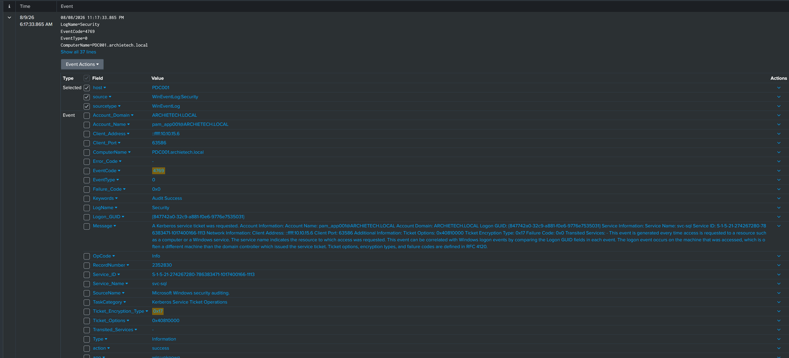
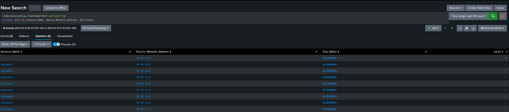

# Incident report: credential access on archietech.local

Simulated in a home lab. The attacks were run with Atomic Red Team against a controlled AD domain; the detections and the telemetry are real. Times are Splunk display time (UTC). The Windows hosts write local time (UTC-7) into the raw event, so the DC-local clock reads seven hours earlier.

## Summary

Two credential-access techniques came from one internal host, `10.10.15.6`, inside a 30-minute window. Both ran under the context `pam_app001@ARCHIETECH.LOCAL`:

- 06:17 UTC: a Kerberos service ticket for `svc-sql` was requested with RC4 (T1558.003). The DC issued it (`Audit Success`).
- ~06:45 UTC: failed logons hit `testuser1` through `testuser8`, all sub-status `0xC000006A` (T1110.003).

No sprayed account signed in successfully, and `svc-sql` was not used after the ticket request, so within the window the hash was neither cracked nor replayed. The two techniques cover each other's weakness. Kerberoasting yields credentials later and silently. Spraying yields them immediately if any password is weak.

## Timeline

| Time (UTC) | Event | Source | Detail |
|---|---|---|---|
| 06:17:33 | TGS requested for `svc-sql` | PDC001 (4769) | RC4 `0x17`, by `pam_app001` from `10.10.15.6`; ticket issued |
| ~06:45 | 8 failed logons, `testuser1` to `testuser8` | PDC001 (4625) | all `0xC000006A`, all from `10.10.15.6`, one attempt each |

## Evidence

Kerberoasting (4769). Requestor `pam_app001@ARCHIETECH.LOCAL`, target `svc-sql`, `Ticket_Encryption_Type=0x17`, `Client_Address=::ffff:10.10.15.6`, `Keywords=Audit Success`.

Password spray (4625). `stats count by Account_Name, Source_Network_Address, Sub_Status` returned eight `testuserN` rows, all `0xC000006A` from `10.10.15.6`, one each.

Full detection logic: [`kerberoasting.md`](../detections/kerberoasting.md), [`password-spray.md`](../detections/password-spray.md).

## Finding: Account_Name is multivalue on 4625

The spray search returned nine statistics rows for eight events. The `WinEventLog` sourcetype extracts `Account_Name` twice per 4625, once for the Subject account (which is `-` on a network logon) and once for the targeted account, and puts both in one multivalue field. `stats by Account_Name` then splits each event. So `dc(Account_Name)` counts nine for an eight-account spray. The `>= 5` threshold still fires, but the reported account count is inflated by one on every spray. The fix goes before the `stats`:

    | eval Account_Name=mvfilter(Account_Name!="-")

`search Account_Name!="-"` does not work here. It drops matching events rather than the unwanted value inside the multivalue field.

## Gaps

- No auto-correlation. The two alerts were joined by hand on the shared source IP. A rule keyed on source IP would close this.
- No spray-to-success rule. A 4624 success from a host that just sprayed is the transition from attempt to compromise, and it is the highest-value next detection.
- Low-and-slow sprays spread over hours stay under the binned threshold and would not fire.
- The multivalue fix above is identified but not yet deployed.
